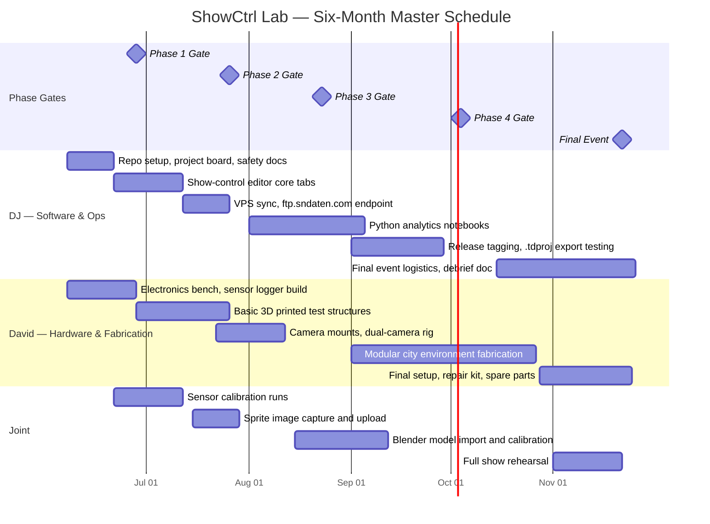

# ShowCtrl Lab — Master Project Hub

> **Maintained by:** DJ (Dayton, OH) · **Collaborator:** David (Detroit, MI)  
> **Organization:** [SuperiorNetworks](https://github.com/SuperiorNetworks)  
> **Status:** Active development · Phase 1 in progress  
> **Budget cap:** $500 total ($250 DJ / $250 David)

---

## What This Repo Is

This is the **single source of truth** for the ShowCtrl Lab project — a remote-collaborative engineering program that builds a browser-based show-control system for an ESP32 T-Display S3, synchronized with audio, relay-triggered effects, camera observation, sensor data logging, and Blender rigid-body simulation. All sub-projects, documentation, phase gates, and budget tracking live here or link from here.

> **Helper note:** Start here every session. Check the [Project Board](../../projects) for open tasks, then open the relevant sub-project repo. Commit your work, tag a release when a phase gate passes, and update the budget tracker below.

---

## Sub-Project Index

| # | Repo | Description | Status |
|---|------|-------------|--------|
| 1 | [tdisplay-show-control-editor](https://github.com/SuperiorNetworks/tdisplay-show-control-editor) | Browser-based show-control editor — audio timeline, relay triggers, sprite simulation, camera monitoring, continuity testing, live workflow | Active |
| 2 | [remote-collapse-lab](https://github.com/SuperiorNetworks/remote-collapse-lab) | Six-month project plan, sensor firmware, Python analytics, Blender simulation pipeline, documentation site | Active |
| 3 | *(this repo)* | Master hub — project plan, Gantt, budget, phase gates, cross-repo links, simulation prompt | Active |

> **Helper note:** Each sub-project repo has its own README. The show-control editor is the software deliverable. The collapse-lab repo is the hardware, sensing, and simulation deliverable. This master hub is the management layer that ties them together.

---

## Project Overview

ShowCtrl Lab is a two-person remote engineering project with three interlocking goals:

**Goal 1 — Show Control Software.** Build a professional browser-based editor that lets a show operator design a cue list of relay triggers synchronized to an audio track, simulate the show visually using before/after sprite images, monitor IP cameras, run continuity tests, and execute the show through a gated approval workflow. The software runs in any browser and exports a `.tdproj` file that the ESP32 T-Display S3 firmware reads directly.

**Goal 2 — Sensor Data Pipeline.** Build an Arduino-based sensor logger that captures acceleration, sound pressure, and vibration data during physical test events. Data is logged to SD card and synced to a VPS via the `ftp.sndaten.com` endpoint. Python analytics notebooks process the raw CSV into plots and summary statistics. Blender rigid-body simulations are calibrated against the measured data.

**Goal 3 — Blender Simulation.** Build a modular 3D city environment using 3D-printed structures. Use measured sensor data from physical tests to calibrate Blender's rigid-body solver. Produce rendered simulation videos that can be compared frame-by-frame against camera footage.

---

## Six-Month Project Plan

### Phase Overview

| Phase | Weeks | Title | Key Deliverable | Gate Criteria |
|-------|-------|-------|-----------------|---------------|
| **1** | 1–4 | Foundation | Repo structure, sensor bench, editor scaffold, safety docs | All hardware powers on; editor loads in browser; safety checklist signed |
| **2** | 5–8 | Validation | First physical test, sensor calibration, timeline editor functional | Sensor data captured and plotted; at least 3 triggers fire correctly |
| **3** | 9–12 | Observation | Dual-camera rig, synchronized playback, sprite simulation working | Camera streams visible in editor; sprites flip on relay state change |
| **4** | 13–20 | Pipeline | Full data pipeline: SD → VPS → Python → Blender → GitHub release | End-to-end pipeline runs unattended; Blender sim matches test video |
| **5** | 21–26 | Final Event | Modular city environment, full show run, debrief, public release | Show runs start-to-finish with no E-stop; debrief document published |

---

### Gantt Chart



> **Helper note:** Milestones (diamonds) are hard go/no-go gates. Do not start the next phase until the gate criteria in the Phase Overview table are met. Use the GitHub Releases tab to tag each gate as `v1.0-phase1-gate`, `v1.0-phase2-gate`, etc.

---

### Phase 1 — Foundation (Weeks 1–4)

**Objective.** Establish the complete technical foundation: repository structure, development environment, sensor hardware bench, show-control editor scaffold, safety documentation, and remote collaboration workflow.

**DJ tasks:**
- Initialize this master hub repo and both sub-project repos with branch protection on `main`
- Set up GitHub Project board with columns: Backlog, In Progress, In Review, Done
- Write and sign the safety checklist (see `docs/safety-and-scope.md` in remote-collapse-lab)
- Configure VPS storage at `ftp.sndaten.com` with a `/showctrl/` project folder
- Deploy the show-control editor to GitHub Pages or Manus hosting for David to access

**David tasks:**
- Assemble the Arduino sensor logger on a breadboard (MPU-6050 + MAX4466 + SD card module)
- Verify sensor logger firmware compiles and logs a 10-second sample CSV
- Print two simple 1:50 scale test structures (rectangular prism with scored weak points)
- Document the bench setup with photos and push to `remote-collapse-lab/hardware/`

**Joint tasks:**
- Agree on the `.tdproj` JSON schema (see `docs/data-schema.md`)
- Agree on the sensor CSV column format (see `sensor-data/sample-data/sample_sensors.csv`)
- Hold weekly 30-minute build review every Sunday

**Gate criteria:** All hardware powers on without errors. Editor loads in browser. Safety checklist signed by both parties. At least one sample sensor CSV committed to the repo.

---

### Phase 2 — Validation (Weeks 5–8)

**Objective.** Run the first physical test event, validate sensor data capture, and confirm that the show-control editor can fire at least three relay triggers correctly in simulation mode.

**DJ tasks:**
- Build and test the Python analytics notebook against the Phase 1 sample CSV
- Create the first `.tdproj` file with 5 triggers and verify export/import round-trip
- Tag `v0.1-phase2` release on the show-control editor repo

**David tasks:**
- Run first physical test: servo-triggered pin release on a printed structure
- Capture dual-angle video and at least 30 seconds of sensor data
- Upload raw data to `ftp.sndaten.com/showctrl/phase2/`

**Joint tasks:**
- Review sensor data plot together; identify any calibration offsets
- Compare video frame timestamps against sensor spike timestamps
- Decide on Blender import format (FBX vs. OBJ) for Phase 4

**Gate criteria:** Sensor data captured and plotted with no missing samples. At least 3 triggers fire correctly in editor simulation. Phase 2 test video committed to repo as a GitHub Release asset.

---

### Phase 3 — Observation (Weeks 9–12)

**Objective.** Add dual-camera observation to the show-control editor, implement sprite simulation, and synchronize camera footage with the audio timeline.

**DJ tasks:**
- Implement camera tab in editor: MJPEG stream display, snapshot capture
- Implement sprite simulation: before/after image swap on relay state change
- Capture before/after sprite images from Phase 2 test footage

**David tasks:**
- Build permanent dual-camera mount for the test rig
- Configure both cameras with static IP addresses on the local network
- Test MJPEG stream URLs and confirm they load in the editor camera tab

**Joint tasks:**
- Record a full synchronized test: audio + sensor + dual camera
- Verify sprite images flip at the correct audio timestamps
- Review Blender model import workflow

**Gate criteria:** Both camera streams visible in editor. Sprites flip correctly on relay state change. Synchronized recording committed as a Phase 3 release asset.

---

### Phase 4 — Pipeline (Weeks 13–20)

**Objective.** Build and validate the complete automated data pipeline from sensor SD card through VPS sync, Python analysis, Blender calibration, and GitHub release artifact.

**DJ tasks:**
- Automate VPS sync: SD card → `ftp.sndaten.com` → Python notebook → plot PNG → GitHub Release
- Write Blender Python import script that reads sensor CSV and sets rigid-body parameters
- Document the full pipeline in `docs/development-workflow.md`

**David tasks:**
- Fabricate first modular city block (2–3 connected structures with shared weak points)
- Run a multi-structure test event and capture full sensor + camera dataset
- Provide Blender .blend file with basic city geometry

**Joint tasks:**
- Calibrate Blender rigid-body solver against Phase 3 physical test data
- Produce first comparison: physical video vs. Blender render side-by-side
- Tag `v0.9-phase4` release with all pipeline artifacts

**Gate criteria:** End-to-end pipeline runs unattended from raw CSV to GitHub Release artifact. Blender simulation visually matches physical test video within acceptable tolerance. Pipeline documented with step-by-step instructions.

---

### Phase 5 — Final Event (Weeks 21–26)

**Objective.** Execute a complete show run of the modular city environment, produce the final comparison video, publish all artifacts as a v1.0 release, and write the project debrief.

**DJ tasks:**
- Load final `.tdproj` into the show-control editor
- Run full continuity test → approval → arm → countdown → execute workflow
- Produce final debrief document: what worked, what changed, lessons learned

**David tasks:**
- Complete modular city environment (minimum 6 structures)
- Prepare repair kit and spare parts for final event day
- Set up and test full rig the day before the event

**Joint tasks:**
- Hold full dress rehearsal one week before final event
- Execute final show run with all systems live
- Publish v1.0 release with: `.tdproj`, sensor data, Python plots, Blender file, comparison video, debrief

**Gate criteria:** Show runs start-to-finish with no E-stop activation. All v1.0 artifacts committed and tagged. Debrief document published.

---

## Budget Tracker

> **Helper note:** Update this table after every purchase. Keep receipts in a shared Google Drive folder linked from the project board. Flag any item that pushes a category over budget before ordering.

### DJ — Dayton, OH ($250 cap)

| Item | Vendor | Est. Cost | Actual | Status |
|------|--------|-----------|--------|--------|
| ESP32 T-Display S3 | AliExpress / Amazon | $18 | — | Pending |
| 16-channel relay module | Amazon | $14 | — | Pending |
| Breadboard + jumper wires | Amazon | $8 | — | Pending |
| USB-C power supply (5V 3A) | Amazon | $10 | — | Pending |
| VPS hosting (6 months) | DigitalOcean / Linode | $30 | — | Pending |
| SD card (32 GB) | Amazon | $8 | — | Pending |
| Misc. wiring, connectors | Local / Amazon | $15 | — | Pending |
| **DJ Subtotal** | | **$103** | — | |

### David — Detroit, MI ($250 cap)

| Item | Vendor | Est. Cost | Actual | Status |
|------|--------|-----------|--------|--------|
| Arduino Mega 2560 | Amazon | $22 | — | Pending |
| MPU-6050 accelerometer (×2) | Amazon | $10 | — | Pending |
| MAX4466 sound sensor (×2) | Amazon | $12 | — | Pending |
| SD card module | Amazon | $6 | — | Pending |
| IP cameras (×2, MJPEG) | Amazon | $50 | — | Pending |
| PLA filament (1 kg) | Amazon / local | $22 | — | Pending |
| Resin for detail prints | Amazon | $25 | — | Pending |
| Plaster / casting supplies | Hardware store | $20 | — | Pending |
| Servo motors (×4) | Amazon | $16 | — | Pending |
| Solenoid latches (×2) | Amazon | $18 | — | Pending |
| Misc. hardware, fasteners | Hardware store | $15 | — | Pending |
| **David Subtotal** | | **$216** | — | |

### Combined

| | DJ | David | Total |
|--|-----|-------|-------|
| **Estimated** | $103 | $216 | **$319** |
| **Cap** | $250 | $250 | **$500** |
| **Remaining** | $147 | $34 | **$181** |

---

## Phase Gate Review Template

Each phase gate review should answer these questions and produce a written record committed to `docs/phase-gates/`:

1. Were all gate criteria met? If not, which were missed and why?
2. Decision: **Go** / **No-Go** / **Repeat with changes**?
3. What is the single most important thing to fix or improve before the next phase?
4. Are we still within budget? Updated budget tracker committed?
5. Is the GitHub Release tagged with all required artifacts?

> **Helper note:** Copy `docs/phase-gates/phase-gate-template.md` from the remote-collapse-lab repo, fill it in, and commit it as `docs/phase-gates/phase-N-review.md` in this master hub repo.

---

## Repository Comparison and Merge Recommendations

The two active sub-project repos were built independently and share overlapping concepts that should be unified. The table below identifies the overlaps and recommends specific corrections.

| Concept | tdisplay-show-control-editor | remote-collapse-lab | Recommendation |
|---------|------------------------------|---------------------|----------------|
| **Data schema** | `.tdproj` JSON (ProjectContext types) | `sensor-data/sample-data/sample_sensors.csv` + `sample_metadata.json` | Add a `docs/data-schema.md` to the editor repo that cross-references the collapse-lab schema. The `.tdproj` should include a `sensorDataUrl` field pointing to the VPS path. |
| **Relay numbering** | Relays 1–15 (active), 16 (continuity test) | Relay references in phase plan use generic "channel" language | Standardize on R1–R15 for effects, R16 for continuity test across both repos. Update collapse-lab docs to use this numbering. |
| **Camera integration** | Camera tab in editor (MJPEG, IP, snapshot) | Camera mentioned in phase plan but no code | Add a `cameras/README.md` to collapse-lab with the same IP/MJPEG config fields used in the editor's `Camera` interface. Link from the editor repo. |
| **Continuity test** | Simulated in RelayTestTab (browser) | Not implemented in firmware | Add a `firmware/continuity_test/` folder to collapse-lab with an Arduino sketch that activates R16 and reads back the circuit. Link from the editor's Relay Test tab documentation. |
| **E-Stop** | Implemented in browser UI (software only) | Mentioned in safety docs as hardware requirement | Add a wiring diagram to collapse-lab `hardware/` showing the physical E-stop button wired to the ESP32 GPIO interrupt. Cross-link from the editor's Live Control tab. |
| **Phase workflow** | 7-step workflow in LiveControlTab | 5-phase project plan in docs/phase-roadmap.md | The editor's 7-step show workflow (Load → Sim → Continuity → Approval → Arm → Countdown → Execute) maps to Phase 5 of the project plan. Add a note to both READMEs clarifying this. |
| **Audio timeline** | Full audio scrubber + trigger editor | Not present | The collapse-lab plan references "synchronized playback" in Phase 3. Add a note to collapse-lab docs that the show-control editor is the synchronization tool. |
| **VPS / data sync** | Not implemented (needs upgrade) | `host-tools/sync/README.md` documents ftp.sndaten.com workflow | Add a `SYNC.md` to the editor repo explaining how `.tdproj` files and sensor data are uploaded to `ftp.sndaten.com/showctrl/`. |
| **Blender simulation** | Sprite before/after images (visual only) | `sim-models/blender-importer/README.md` | The editor's sprite system is the *preview* layer. The collapse-lab Blender pipeline is the *analysis* layer. Document this distinction in both READMEs. |
| **Versioning** | No release tags yet | No release tags yet | Both repos should adopt the same tag format: `v0.1-phase1-gate`, `v0.2-phase2-gate`, etc. Add a `VERSIONING.md` to this master hub. |

---

## Simulation Prompt

Use the prompt below to generate a front-end visual simulation of the final product. See the **Questions** section immediately after for the details needed to make it fully accurate.

```
Build a React + Tailwind CSS browser simulation of a show-control system for a 
modular 1:50 scale city environment. The simulation should visualize:

1. A top-down 2D city grid (configurable number of city blocks, each block 
   represented as a labeled rectangle). Each block is linked to a relay channel 
   (R1–R15). Blocks display their current state: INTACT (dark gray fill, white 
   label) or COLLAPSED (red/orange fill, debris texture overlay, label dimmed).

2. An audio timeline scrubber at the bottom showing the total show duration in 
   seconds. A playhead moves in real time. At each trigger time, the linked 
   city block transitions from INTACT to COLLAPSED with a CSS animation 
   (shake → crack → collapse over 800ms).

3. A relay status panel on the right showing all 15 relay channels as LED 
   indicators (amber = active, dark = inactive). Each indicator shows the relay 
   number, assigned block name, and current state.

4. A camera overlay panel showing two placeholder camera feeds (labeled CAM 1 
   and CAM 2) as dark rectangles with a simulated scan-line effect.

5. A system mode banner at the top that cycles through: STANDBY → SIMULATION → 
   CONTINUITY TEST → ARMED → COUNTDOWN (5…1) → LIVE → COMPLETE. The banner 
   color changes: gray (standby), cyan (simulation), yellow (continuity), 
   amber (armed/countdown), red pulse (live), green (complete).

6. An E-STOP button that immediately halts playback, resets all blocks to 
   INTACT, and sets the banner to E-STOP (red).

Use JetBrains Mono for all text. Dark background (#0d0e10). Amber accent 
(#f59e0b). The city grid should be SVG-based for smooth animations. 
Trigger data should be hardcoded as a demo sequence of 8 triggers spread 
across a 60-second show. Export the full simulation as a single self-contained 
HTML file with no external dependencies.
```

---

## Questions Needed to Produce a Working Simulation

To build a simulation that accurately reflects the real project rather than a generic demo, the following details are needed:

| # | Question | Why It Matters |
|---|----------|----------------|
| 1 | **How many city blocks / structures are in the final environment?** (e.g., 6, 10, 12) | Determines the grid layout and number of relay assignments |
| 2 | **What is the approximate layout of the city grid?** (e.g., 3×2, 4×3, linear street, L-shape) | Determines the SVG coordinate system and block positioning |
| 3 | **What are the names or labels for each block?** (e.g., "Bank", "Hotel", "Warehouse") | Used as block labels in the simulation |
| 4 | **What is the total show duration in seconds?** | Sets the timeline scrubber length |
| 5 | **What is the approximate sequence of collapses?** (e.g., Block 1 at 10s, Block 2 at 15s, etc.) | Used to generate the demo trigger sequence |
| 6 | **Should the collapse animation be instantaneous or staged?** (e.g., shake → crack → fall, or just a single flash) | Determines the CSS animation complexity |
| 7 | **Is there audio in the simulation?** (e.g., a specific MP3 URL, or just a visual timeline with no sound) | Determines whether the `<audio>` element is wired to the scrubber |
| 8 | **What are the two camera angles?** (e.g., overhead, street-level front, street-level side) | Used to label the camera overlay panels |
| 9 | **Should the simulation be a standalone HTML file or a React component?** | Determines the output format |
| 10 | **Are there any specific colors or branding elements** beyond the Industrial Dark Console palette? | Ensures the simulation matches the real show aesthetic |

---

## Development and Management Instructions

> **Helper note:** This section is the operating manual for the project. Read it at the start of every work session.

### Branch Strategy

All repos use the same branch strategy. `main` is protected — no direct pushes. All work happens on feature branches named `phase-N/description` (e.g., `phase-1/sensor-logger-firmware`). Pull requests require one review before merge. Phase gate releases are tagged on `main` immediately after the gate review.

### Weekly Workflow

Every Sunday, both collaborators should:
1. Push all in-progress work to their feature branch
2. Open or update GitHub Issues for any blockers
3. Join the 30-minute build review call
4. Update the budget tracker in this README if any purchases were made
5. Move completed GitHub Project board cards to Done

### Release Tagging

Tags follow the format `vMAJOR.MINOR-phaseN-gate`. For example, the Phase 1 gate release is `v0.1-phase1-gate`. Each release must include:
- A release description summarizing what was completed
- All relevant artifacts attached (sensor CSV, `.tdproj` file, photos, video clips)
- An updated budget tracker screenshot

### Data Sync

Sensor data and project files are synced to `ftp.sndaten.com/showctrl/` using the workflow documented in `remote-collapse-lab/host-tools/sync/README.md`. The folder structure is:

```
ftp.sndaten.com/showctrl/
├── phase1/
│   └── sample_sensors.csv
├── phase2/
│   ├── test_001_sensors.csv
│   └── test_001_metadata.json
└── releases/
    └── v0.1-phase1-gate/
```

---

## License

MIT — see [LICENSE](LICENSE)

---

## References

- [Arduino Official Documentation](https://docs.arduino.cc/)
- [GitHub Releases Documentation](https://docs.github.com/en/repositories/releasing-projects-on-github/about-releases)
- [Semantic Versioning 2.0.0](https://semver.org/)
- [ESP32 T-Display S3 Product Page](https://www.lilygo.cc/products/t-display-s3)
- [Blender Rigid Body Simulation Docs](https://docs.blender.org/manual/en/latest/physics/rigid_body/index.html)
