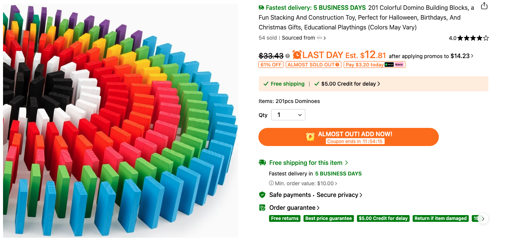

# DEMOLITION DERBY
### A Remote Show-Control & Structural Collapse Simulation Program
**Superior Networks LLC · Dwain Henderson Jr. (Dayton, OH) & David (Detroit, MI)**

> *Two engineers. Two boards. One system built from scratch.*

---

## 🗓️ PHASE 1 TARGET DATE — **Friday, July 10, 2026**

**Goal:** Both Dwain and David arrive with their individual 4×6 project boards, connect them side-by-side, and fire the first live relay-triggered sequences together in person — the first real detonation event of the Demolition Derby program.

---

## Program Overview

Demolition Derby is a three-repository engineering program building a complete remote show-control system: a browser-based sequencing editor, a relay-trigger hardware board, and a sensor/analytics/simulation pipeline. The program is developed in parallel by two engineers working across two cities — **David in Detroit, MI** and **Dwain in Dayton, OH** — who each build and test independently, then integrate at defined milestone dates.

**David** leads the full technical stack: ESP32 firmware development, relay logic design, hardware board architecture, and the DETONATOR browser application. He is proving that the software, the microcontroller, and the relay hardware all communicate correctly as a unified system.

**Dwain** leads research, documentation, physical board construction, and safety operations. He builds alongside David as David proves the logic — replicating the hardware setup in Dayton, testing sequences, and maintaining the project record. Dwain is also the designated safety officer for all live-fire sessions.

The program is organized into three sub-projects, each with its own GitHub repository:

| Codename | Repository | Role |
|----------|-----------|------|
| **DEMOLITION DERBY** | [SuperiorNetworks/demolition-derby](https://github.com/SuperiorNetworks/demolition-derby) | Master hub — this document |
| **DETONATOR** | [SuperiorNetworks/detonator](https://github.com/SuperiorNetworks/detonator) | Browser show-control editor (React, relay sequencing, live workflow) |
| **DOWNRANGE DOCUMENT (DD)** | [SuperiorNetworks/downrange-document](https://github.com/SuperiorNetworks/downrange-document) | Sensor firmware, Python analytics, Blender 3D reconstruction pipeline |

---

## Phase 1 — The Board (Iteration 1)

### Decision Log — Recorded June 8, 2026

The following decisions were made jointly by Dwain and David and are locked for Phase 1. They represent a deliberate choice to keep the first iteration simple, functional, and demonstrable before adding complexity.

**Board Dimensions:** 4 feet wide × 6 feet long (4×6). Each engineer builds one identical board independently. The boards are designed to be portable — flat on a round table or card table at waist height — and can be assembled together when both engineers meet.

**Structure Materials (Phase 1):** Wooden dominoes only. David sourced a 201-piece colorful bulk domino set from Temu. These will be used to build three structure pads on the board: one large pad, one medium pad, and one small pad. City scenery and infrastructure will be placed adjacent to each pad. Building materials will be iterated in Phase 2 and beyond.

**Phase 1 Domino Set — Purchased:**



> **201 Colorful Domino Building Blocks** — Fun Stacking and Construction Toy. Wooden, multi-color. Purchased from Temu.
> [Product Link](https://www.temu.com/201-colorful-domino-building-blocks-a-fun-stacking-and-construction-toy--halloween-birthdays-and-christmas-gifts-educational--colors-may--g-605976816111107.html)

**Relay Wiring (Phase 1):** Four-channel wiring only. Relays are permanently mounted on the board in a visually appealing, stylish arrangement. Trace wires are routed to look clean and intentional — not hidden, but part of the aesthetic. Each relay terminates at a pre-wired pad positioned at the three structure zones.

**Phase 1 Scope — What IS included:**

- 4×6 plywood or foam-core project board per engineer
- Permanent relay mount (4-channel, styled)
- Pre-wired pads at large, medium, and small structure zones
- Domino structures at each pad
- City/infrastructure scenery adjacent to pads
- DETONATOR web app talking to relay board over internet (4-channel)
- Proof-of-concept: browser fires relay sequence, relay fires at pad

**Phase 1 Scope — What is NOT included (deferred to later phases):**

- Cameras (deferred to Phase 3)
- Sensors / data logging (deferred to Phase 3)
- Additional pyrotechnic types beyond small firecrackers (deferred)
- Blender simulation pipeline (deferred to Phase 3–4)
- Automated data pipeline (deferred to Phase 4)

### Board Layout Concept

```
┌─────────────────────────────────────────────┐
│  4 ft wide × 6 ft long — PROJECT BOARD       │
│                                              │
│  ┌──────────────┐   ┌────────┐   ┌──────┐   │
│  │  LARGE PAD   │   │  MED   │   │ SML  │   │
│  │  (dominoes)  │   │  PAD   │   │ PAD  │   │
│  │  R1 ──────── │   │  R2 ── │   │ R3 ──│   │
│  └──────────────┘   └────────┘   └──────┘   │
│                                              │
│  [city scenery / infrastructure]             │
│                                              │
│  ┌──────────────────────────────────────┐    │
│  │  RELAY BOARD (4-ch, styled mount)    │    │
│  │  R1  R2  R3  R4  — trace wired       │    │
│  └──────────────────────────────────────┘    │
│                                              │
│  Board sits flat on card table (waist ht)    │
└─────────────────────────────────────────────┘
```

### Division of Labor

| Engineer | Location | Primary Role | Phase 1 Focus |
|----------|----------|-------------|---------------|
| **David** | Detroit, MI | **Firmware & Systems Engineer** — ESP32 programming, relay logic design, hardware board architecture, DETONATOR browser app development | Prove end-to-end: browser → internet → ESP32 → relay fires on sequence |
| **Dwain** | Dayton, OH | **Research, Documentation & Safety Lead** — project organization, build replication, testing alongside David, safety officer for all live-fire sessions | Replicate David's hardware build in Dayton; document decisions; own the safety protocol |

---

## Phase 1 Conflict Analysis

The following items in the original six-month plan **conflict with or are superseded by** the Phase 1 decisions above. These are not errors — they are deferred scope items that will be addressed in later phases.

| Conflict | Original Plan | Phase 1 Decision | Resolution |
|----------|--------------|-----------------|------------|
| **Cameras** | Phase 2 included IP cameras and MJPEG streams | Phase 1 has no cameras | Deferred to Phase 3 |
| **Sensors** | Phase 2 included accelerometers and IMU logging | Phase 1 has no sensors | Deferred to Phase 3 |
| **Building materials** | Plan included concrete mix ratios, plaster, frangible resin | Phase 1 uses wooden dominoes only | Deferred to Phase 2 |
| **Blender pipeline** | Phase 3–4 included 3D reconstruction from sensor data | No sensor data in Phase 1 | Deferred to Phase 4 |
| **16-channel relay** | Original spec referenced up to 16 relay channels | Phase 1 uses 4 channels only | Expand in Phase 2 |
| **Multi-user approval** | DETONATOR includes a multi-user arm/approve workflow | Phase 1 is single-user proof-of-concept | Full workflow in Phase 2 |
| **Gantt timeline** | Six-month plan assumed parallel hardware + software tracks | Phase 1 is sequential: software first, then hardware integration | Gantt updated below |

---

## Expense Tracker

All project expenses are logged here. Both engineers track independently and report at each integration session.

| Date | Engineer | Item | Source | Unit Cost | Qty | Total |
|------|----------|------|--------|-----------|-----|-------|
| 2026-06-08 | Dwain | 201-pc Colorful Domino Set | Temu | $15.00 | 1 | $15.00 |
| 2026-06-08 | David | 201-pc Colorful Domino Set | Temu | $15.00 | 1 | $15.00 |

**Program Total to Date: $30.00**

> Expenses will be updated after each purchase. Add a row to this table and commit to `main` with the message format: `expenses: add [item] [date]`

---

## Building Materials & Scenery — Discussion List for Dwain & David

The following items have been identified as candidates for Phase 1 scenery and Phase 2+ structure materials. No purchases have been made beyond the domino sets. Review each link and discuss which to order before July 10, 2026.

### Phase 1 — Purchased

| Item | Engineer | Cost | Link |
|------|----------|------|------|
| 201-pc Colorful Domino Building Blocks | Dwain & David | $15.00 each | [Temu](https://www.temu.com/201-colorful-domino-building-blocks-a-fun-stacking-and-construction-toy--halloween-birthdays-and-christmas-gifts-educational--colors-may--g-605976816111107.html) |

### Phase 1 Scenery Candidates — Order Before July 10

| # | Item | Notes | Link |
|---|------|-------|------|
| 1 | **City Building Blocks (search results)** | Browse full selection | [Temu Search](https://www.temu.com/search_result.html?search_key=city%20building%20blocks&search_method=suggest&sprefix=city%20building%20blocks) |
| 2 | **51-pc Magnetic Road Construction Kit** | Crane + vehicles, STEM, urban layout | [Temu](https://www.temu.com/51pcs-magnetic-road-construction-kit-featuring-crane-and-vehicles-stem-educational-building-blocks-urban-development-toy-set-ideal-holiday-present-for-children-aged-3-and-above-g-606120026426430.html) |
| 3 | **Wooden 3D Puzzle DIY Town Assembly Model** | Characters + accessories, craftable | [Temu](https://www.temu.com/-building-wooden-3d-puzzle-diy--town-assembly-model-with-characters-and-accessories-creative-craft-toys--2--doll-ornaments-g-605842917145710.html) |
| 4 | **Model Planning Building — Apartment / High-Rise** | Plastic sand scene building material, architectural scale model | [Temu](https://www.temu.com/model-planning-building-apartment-house-high-building-sand-building-scene-building-production-material-plastic--g-606019816125554.html) |
| 5 | **Model & Hobby Building — Diorama Materials** | Full diorama supply category — terrain, foliage, ground cover, scale details | [Temu](https://www.temu.com/model-hobby-building-o3-2188.html?opt_level=2&title=Model%20%26%20Hobby%20Building&show_search_type=0) |
| 6 | **City Building Mat — Base Mat Search** | Printed city grid / road mat for the board base surface | [Temu Search](https://www.temu.com/search_result.html?search_key=city%20buildingmat&search_method=user) |

### Phase 2+ Structure Material Candidates

| # | Item | Notes | Link |
|---|------|-------|------|
| 5 | **51-pc Magnetic Road Construction Kit** *(also Phase 1 candidate)* | Expandable road/city layout | [Temu](https://www.temu.com/51pcs-magnetic-road-construction-kit-featuring-crane-and-vehicles-stem-educational-building-blocks-urban-development-toy-set-ideal-holiday-present-for-children-aged-3-and-above-g-606120026426430.html) |
| 6 | **Model Planning Building — Apartment / High-Rise** *(also Phase 1 candidate)* | Plastic architectural model pieces, good for multi-story structures | [Temu](https://www.temu.com/model-planning-building-apartment-house-high-building-sand-building-scene-building-production-material-plastic--g-606019816125554.html) |

> **Note for Dwain & David:** Items 2, 4, and 6 are the strongest Phase 1 picks — the magnetic road kit gives you city infrastructure, the high-rise model kit gives you realistic structures, and a printed city mat gives the board a finished base that makes everything look intentional. Item 5 (diorama materials) is a Phase 2 investment — terrain, foliage, and ground cover will make the board look like a real film set. Discuss and decide before ordering so you both get the same items.

---

## Safety

The Demolition Derby program operates with small consumer-grade firecrackers as the charge event at each relay pad. The following safety rules apply to every session, including solo build sessions and the July 10, 2026 live event.

### General Rules

| Rule | Requirement |
|------|-------------|
| **Minimum distance** | All personnel must be at least 10 feet from the board during any armed sequence | 
| **Eye protection** | Safety glasses required for all personnel present during armed or live-fire sessions |
| **Ear protection** | Hearing protection recommended during live-fire sequences |
| **Fire extinguisher** | A dry chemical or CO₂ extinguisher must be within arm's reach at all times during live-fire |
| **Clear the area** | Confirm no bystanders are within the safety perimeter before arming |
| **No alcohol** | No alcohol or impairment during any session involving live charges |
| **One operator** | Only one person operates DETONATOR during a live-fire sequence |
| **E-STOP accessible** | The E-STOP button in DETONATOR must be visible and reachable by the operator at all times |

### Arm / Fire Sequence Protocol

The DETONATOR app enforces a multi-step sequence before any relay fires. The protocol is:

1. **LOAD** — Project is loaded and reviewed. No charges armed.
2. **SIMULATION** — Visual simulation run confirms sequence timing. No relay output.
3. **CONTINUITY TEST** — R4 continuity check confirms wiring integrity. No charge fired.
4. **APPROVAL** — Both engineers verbally confirm readiness. Operator clicks Approve.
5. **ARM** — System enters armed state. Header turns amber. 10-second countdown begins.
6. **EXECUTE** — Sequence fires on schedule. E-STOP available throughout.
7. **SAFE** — System returns to standby. Board is physically inspected before approach.

### Phase 1 Specific Notes

Phase 1 uses small consumer firecrackers as the charge event. These are legal consumer fireworks. The following additional rules apply:

- Charges are placed at relay pads immediately before the session — never left wired and unattended
- The board is treated as live from the moment charges are placed until the post-fire inspection is complete
- Both engineers must be present and in agreement before any charge is placed or fired
- The session location must be outdoors or in a well-ventilated space with adequate clearance above the board
- A bucket of water or sand must be present as a secondary fire suppression option

### Emergency Contacts

| Contact | Number |
|---------|--------|
| Emergency / Fire | 911 |
| Poison Control | 1-800-222-1222 |

---

## Six-Month Phase Roadmap

| Phase | Codename | Target | Key Deliverable |
|-------|----------|--------|----------------|
| **1** | Lay the Ground | **July 10, 2026** 🎯 | Both boards present, connected in person — live 4-ch relay fires via DETONATOR, first detonation event |
| **2** | First Strike | August 2025 | 16-ch relay, expanded structures, second building material iteration |
| **3** | Eyes Open | September 2025 | Cameras live, sensors logging, DOWNRANGE DOCUMENT pipeline active |
| **4** | The Machine | October 2025 | Automated sensor → CSV → Python → Blender pipeline end-to-end |
| **5** | The District Falls | November–December 2025 | Full show run — both boards, full sequence, full data capture |

---

## Sub-Project Status

### DETONATOR — Browser Show-Control Editor
**Repo:** [SuperiorNetworks/detonator](https://github.com/SuperiorNetworks/detonator)
**Live App:** [safeshowctl-bmq5yryr.manus.space](https://safeshowctl-bmq5yryr.manus.space)
**Status:** ✅ Active development — David

DETONATOR is a React-based browser application providing a full show-control workflow: project management, audio-synchronized relay timeline, visual city simulation, camera monitoring, relay diagnostics, live execution with arm/approve/execute sequence, and event logs. The Phase 1 focus is proving that the web app can communicate with the relay board over the internet and fire a 4-channel sequence reliably.

### DOWNRANGE DOCUMENT (DD) — Sensor + Analytics + Blender
**Repo:** [SuperiorNetworks/downrange-document](https://github.com/SuperiorNetworks/downrange-document)
**Status:** 🟡 Standby — activates Phase 3

DOWNRANGE DOCUMENT contains the Arduino-compatible sensor logger firmware, Python analytics scripts for CSV post-processing, and the Blender import pipeline for 3D structural collapse reconstruction. This sub-project is in standby until Phase 3 when cameras and sensors are added to the boards.

---

## Repository Structure

```
demolition-derby/               ← You are here (master hub)
├── README.md                   ← This document — master plan and status
├── VERSIONING.md               ← Version and tagging conventions
├── EXPENSES.md                 ← Full expense log (detailed)
├── BOARD-DESIGN.md             ← Physical board design spec and notes
├── LICENSE
└── docs/
    ├── assets/
    │   └── dominos-colorful-201pc.png
    ├── phase-gates/
    │   └── phase-gate-template.md
    └── phase-roadmap.md
```

---

## How to Contribute

Both engineers commit directly to `main` for documentation and notes. For software changes, use feature branches and pull requests in the respective sub-project repos (DETONATOR, DOWNRANGE DOCUMENT).

Commit message conventions:

| Prefix | Use for |
|--------|---------|
| `docs:` | README, notes, design decisions |
| `expenses:` | Adding expense rows |
| `board:` | Physical board design updates |
| `phase:` | Phase gate completions or updates |
| `fix:` | Corrections to existing content |

---

## Contact

**Dwain Henderson Jr.** — Superior Networks LLC, Dayton OH 45342
**David** — Co-engineer, software lead

*Demolition Derby is a private engineering project. All content in this repository is for documentation and development purposes.*
