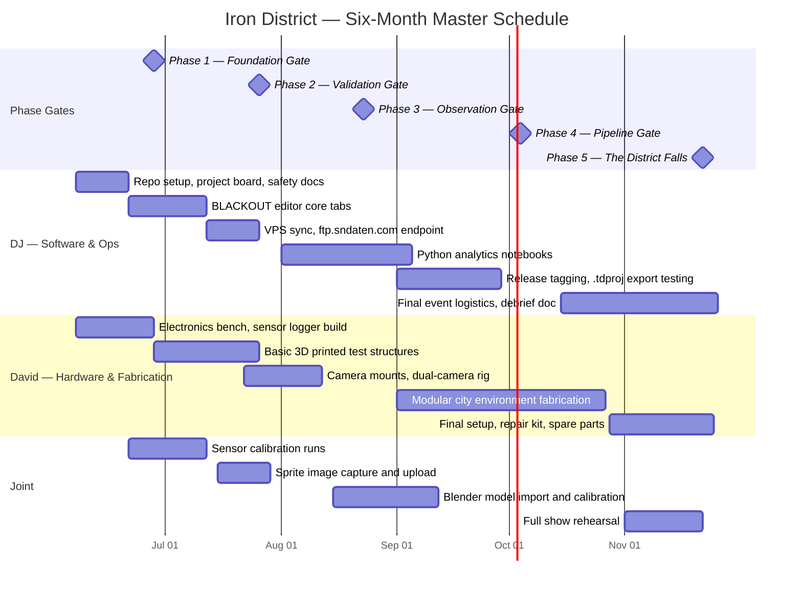

# IRON DISTRICT — Master Project Hub

> *Two engineers. Two cities. One system built from scratch.*

**DJ** · Dayton, OH &nbsp;|&nbsp; **David** · Detroit, MI  
**Organization:** [SuperiorNetworks](https://github.com/SuperiorNetworks)  
**Status:** Active — Phase 1 in progress  
**Budget cap:** $500 total ($250 DJ / $250 David)

---

## The Project

**Iron District** is a remote-collaborative engineering program built by DJ and David — two engineers who decided to stop talking about building something serious and actually do it. The project has three interlocking deliverables:

**BLACKOUT** — a browser-based show-control system for an ESP32 T-Display S3. It lets you design a cue list of relay triggers synchronized to an audio track, simulate the show visually, monitor IP cameras, run continuity tests, and execute the show through a gated approval workflow. It exports a `.tdproj` file the microcontroller reads directly.

**GROUNDWORK** — an Arduino-based sensor data pipeline that captures acceleration, sound pressure, and vibration during physical test events. Data syncs to a VPS, runs through Python analytics notebooks, and calibrates Blender rigid-body simulations.

**THE GRID** — a modular 1:50 scale city environment built from 3D-printed structures. Physical tests are measured, logged, and compared against Blender simulations frame-by-frame.

> **Helper note — start here every session.** Check the [Project Board](../../projects) for open tasks, open the relevant sub-project repo, commit your work, and tag a release when a phase gate passes. Update the budget tracker below after every purchase.

---

## Sub-Project Index

| Repo | Codename | Description | Status |
|------|----------|-------------|--------|
| [blackout-show-control](https://github.com/SuperiorNetworks/blackout-show-control) | **BLACKOUT** | Browser show-control editor — audio timeline, relay triggers, sprite simulation, camera monitoring, continuity testing, live workflow | Active |
| [groundwork-collapse-lab](https://github.com/SuperiorNetworks/groundwork-collapse-lab) | **GROUNDWORK** | Sensor firmware, Python analytics, Blender simulation pipeline, six-month project documentation | Active |
| *(this repo)* | **IRON DISTRICT** | Master hub — project plan, Gantt, budget, phase gates, cross-repo links | Active |

---

## Six-Month Project Plan

### Phase Overview

| Phase | Weeks | Name | Key Deliverable | Gate Criteria |
|-------|-------|------|-----------------|---------------|
| **1 — FOUNDATION** | 1–4 | Lay the Ground | Repo structure, sensor bench, editor scaffold, safety docs | Hardware powers on; editor loads in browser; safety checklist signed |
| **2 — VALIDATION** | 5–8 | First Strike | First physical test, sensor calibration, timeline editor functional | Sensor data captured and plotted; 3+ triggers fire correctly |
| **3 — OBSERVATION** | 9–12 | Eyes Open | Dual-camera rig, synchronized playback, sprite simulation live | Camera streams in editor; sprites flip on relay state change |
| **4 — PIPELINE** | 13–20 | The Machine | Full data pipeline: SD → VPS → Python → Blender → GitHub release | End-to-end pipeline runs unattended; Blender sim matches test video |
| **5 — FINAL EVENT** | 21–26 | The District Falls | Full show run on modular city, debrief, public v1.0 release | Show runs start-to-finish with no E-stop; debrief published |

---

### Gantt Chart



> **Helper note:** Milestones (diamonds) are hard go/no-go gates. Do not start the next phase until the gate criteria above are met. Tag each gate as `v0.N-phaseN-gate` on all three repos simultaneously. See [VERSIONING.md](VERSIONING.md) for the full policy.

---

### Phase 1 — FOUNDATION (Weeks 1–4)

**Objective.** Establish the complete technical foundation: repository structure, development environment, sensor hardware bench, BLACKOUT editor scaffold, safety documentation, and remote collaboration workflow.

**DJ tasks.** Initialize all three repos with branch protection on `main`. Set up the GitHub Project board with columns: Backlog, In Progress, In Review, Done. Write and sign the safety checklist. Configure VPS storage at `ftp.sndaten.com` with a `/irondistrict/` project folder. Deploy the BLACKOUT editor to Manus hosting for David to access from Detroit.

**David tasks.** Assemble the Arduino sensor logger on a breadboard (MPU-6050 + MAX4466 + SD card module). Verify sensor logger firmware compiles and logs a 10-second sample CSV. Print two simple 1:50 scale test structures with scored weak points. Document the bench setup with photos and push to `groundwork-collapse-lab/hardware/`.

**Joint tasks.** Agree on the `.tdproj` JSON schema. Agree on the sensor CSV column format. Hold weekly 30-minute build review every Sunday.

**Gate criteria:** All hardware powers on without errors. BLACKOUT editor loads in browser. Safety checklist signed by both. At least one sample sensor CSV committed to the repo.

---

### Phase 2 — VALIDATION: First Strike (Weeks 5–8)

**Objective.** Run the first physical test, validate sensor data capture, and confirm the BLACKOUT editor can fire at least three relay triggers correctly in simulation mode.

**DJ tasks.** Build and test the Python analytics notebook against the Phase 1 sample CSV. Create the first `.tdproj` file with 5 triggers and verify export/import round-trip. Tag `v0.1-phase2-gate` release on the BLACKOUT repo.

**David tasks.** Run first physical test: servo-triggered pin release on a printed structure. Capture dual-angle video and at least 30 seconds of sensor data. Upload raw data to `ftp.sndaten.com/irondistrict/phase2/`.

**Joint tasks.** Review sensor data plot together; identify calibration offsets. Compare video frame timestamps against sensor spike timestamps. Decide on Blender import format (FBX vs. OBJ) for Phase 4.

**Gate criteria:** Sensor data captured and plotted with no missing samples. At least 3 triggers fire correctly in BLACKOUT simulation. Phase 2 test video committed as a GitHub Release asset.

---

### Phase 3 — OBSERVATION: Eyes Open (Weeks 9–12)

**Objective.** Add dual-camera observation to BLACKOUT, implement sprite simulation, and synchronize camera footage with the audio timeline.

**DJ tasks.** Implement camera tab: MJPEG stream display, snapshot capture. Implement sprite simulation: before/after image swap on relay state change. Capture before/after sprite images from Phase 2 test footage.

**David tasks.** Build permanent dual-camera mount for the test rig. Configure both cameras with static IP addresses. Test MJPEG stream URLs and confirm they load in the BLACKOUT camera tab.

**Joint tasks.** Record a full synchronized test: audio + sensor + dual camera. Verify sprite images flip at the correct audio timestamps. Review Blender model import workflow.

**Gate criteria:** Both camera streams visible in editor. Sprites flip correctly on relay state change. Synchronized recording committed as a Phase 3 release asset.

---

### Phase 4 — PIPELINE: The Machine (Weeks 13–20)

**Objective.** Build and validate the complete automated data pipeline from sensor SD card through VPS sync, Python analysis, Blender calibration, and GitHub release artifact.

**DJ tasks.** Automate VPS sync: SD card → `ftp.sndaten.com` → Python notebook → plot PNG → GitHub Release. Write Blender Python import script that reads sensor CSV and sets rigid-body parameters. Document the full pipeline in `docs/development-workflow.md`.

**David tasks.** Fabricate first modular city block (2–3 connected structures with shared weak points). Run a multi-structure test event and capture full sensor + camera dataset. Provide Blender `.blend` file with basic city geometry.

**Joint tasks.** Calibrate Blender rigid-body solver against Phase 3 physical test data. Produce first comparison: physical video vs. Blender render side-by-side. Tag `v0.9-phase4-gate` release with all pipeline artifacts.

**Gate criteria:** End-to-end pipeline runs unattended from raw CSV to GitHub Release artifact. Blender simulation visually matches physical test video. Pipeline documented with step-by-step instructions.

---

### Phase 5 — FINAL EVENT: The District Falls (Weeks 21–26)

**Objective.** Execute a complete show run of the modular city environment, produce the final comparison video, publish all artifacts as a v1.0 release, and write the project debrief.

**DJ tasks.** Load final `.tdproj` into BLACKOUT. Run full continuity test → approval → arm → countdown → execute workflow. Produce final debrief document: what worked, what changed, lessons learned.

**David tasks.** Complete modular city environment (minimum 6 structures). Prepare repair kit and spare parts for final event day. Set up and test full rig the day before the event.

**Joint tasks.** Hold full dress rehearsal one week before final event. Execute final show run with all systems live. Publish v1.0 release with: `.tdproj`, sensor data, Python plots, Blender file, comparison video, debrief.

**Gate criteria:** Show runs start-to-finish with no E-stop activation. All v1.0 artifacts committed and tagged. Debrief document published.

---

## Budget Tracker

> **Helper note:** Update this table after every purchase. Keep receipts in a shared folder. Flag any item that pushes a category over budget before ordering.

### DJ — Dayton, OH ($250 cap)

| Item | Vendor | Est. Cost | Actual | Status |
|------|--------|-----------|--------|--------|
| ESP32 T-Display S3 | AliExpress / Amazon | $18 | — | Pending |
| 16-channel relay module | Amazon | $14 | — | Pending |
| Breadboard + jumper wires | Amazon | $8 | — | Pending |
| USB-C power supply (5V 3A) | Amazon | $10 | — | Pending |
| VPS hosting (6 months) | DigitalOcean / Linode | $30 | — | Pending |
| SD card (32 GB) | Amazon | $8 | — | Pending |
| Misc. wiring, connectors | Local / Amazon | $15 | — | Pending |
| **DJ Subtotal** | | **$103** | — | |

### David — Detroit, MI ($250 cap)

| Item | Vendor | Est. Cost | Actual | Status |
|------|--------|-----------|--------|--------|
| Arduino Mega 2560 | Amazon | $22 | — | Pending |
| MPU-6050 accelerometer (×2) | Amazon | $10 | — | Pending |
| MAX4466 sound sensor (×2) | Amazon | $12 | — | Pending |
| SD card module | Amazon | $6 | — | Pending |
| IP cameras (×2, MJPEG) | Amazon | $50 | — | Pending |
| PLA filament (1 kg) | Amazon / local | $22 | — | Pending |
| Resin for detail prints | Amazon | $25 | — | Pending |
| Plaster / casting supplies | Hardware store | $20 | — | Pending |
| Servo motors (×4) | Amazon | $16 | — | Pending |
| Solenoid latches (×2) | Amazon | $18 | — | Pending |
| Misc. hardware, fasteners | Hardware store | $15 | — | Pending |
| **David Subtotal** | | **$216** | — | |

### Combined

| | DJ | David | Total |
|--|-----|-------|-------|
| **Estimated** | $103 | $216 | **$319** |
| **Cap** | $250 | $250 | **$500** |
| **Remaining** | $147 | $34 | **$181** |

---

## Repo Comparison — Merge Recommendations

The two sub-project repos were built independently and share overlapping concepts that need to be unified. These corrections should be applied before Phase 2 begins.

| # | Concept | Gap | Fix |
|---|---------|-----|-----|
| 1 | **Data schema** | BLACKOUT has `.tdproj` JSON; GROUNDWORK has sensor CSV — no cross-reference | Add `sensorDataUrl` field to `.tdproj`; add `docs/data-schema.md` to BLACKOUT repo |
| 2 | **Relay numbering** | BLACKOUT uses R1–R16; GROUNDWORK uses generic "channel" language | Standardize R1–R15 effects, R16 continuity test across both repos |
| 3 | **Camera config** | BLACKOUT has full `Camera` interface; GROUNDWORK has no camera config files | Add `cameras/README.md` to GROUNDWORK using the same field names as BLACKOUT |
| 4 | **Continuity firmware** | BLACKOUT simulates continuity in browser; no matching Arduino sketch exists | Add `firmware/continuity_test/` to GROUNDWORK with an Arduino sketch for R16 |
| 5 | **E-Stop hardware** | BLACKOUT has software E-stop; GROUNDWORK safety docs mention it abstractly | Add wiring diagram to GROUNDWORK `hardware/` for physical E-stop GPIO interrupt |
| 6 | **Phase workflow mapping** | BLACKOUT's 7-step show workflow is not linked to the Phase 5 deliverable | Add a note to both READMEs: the 7-step workflow IS the Phase 5 deliverable |
| 7 | **Audio timeline** | GROUNDWORK Phase 3 references "synchronized playback" but has no audio tooling | Add a note to GROUNDWORK: BLACKOUT is the synchronization tool |
| 8 | **VPS sync docs** | GROUNDWORK has `ftp.sndaten.com` sync docs; BLACKOUT has none | Add `SYNC.md` to BLACKOUT explaining the `/irondistrict/` VPS folder structure |
| 9 | **Sprite vs. Blender** | Both repos have visual components that appear redundant | Document clearly: BLACKOUT sprites = real-time preview; GROUNDWORK Blender = post-event analysis |
| 10 | **Release tags** | Neither repo has any tags yet | Both repos tag simultaneously at each gate: `v0.N-phaseN-gate` |

---

## Phase Gate Review Template

Each phase gate review should answer these five questions and produce a written record committed to `docs/phase-gates/`:

1. Were all gate criteria met? If not, which were missed and why?
2. Decision: **Go** / **No-Go** / **Repeat with changes**?
3. What is the single most important thing to fix before the next phase?
4. Are we still within budget? Updated budget tracker committed?
5. Is the GitHub Release tagged with all required artifacts?

> **Helper note:** Copy `docs/phase-gates/phase-gate-template.md`, fill it in, and commit it as `docs/phase-gates/phase-N-review.md` in this repo.

---

## Development and Management Instructions

> **Helper note:** This section is the operating manual. Read it at the start of every work session.

**Branch strategy.** `main` is protected — no direct pushes. All work happens on feature branches named `phase-N/description` (e.g., `phase-1/sensor-logger-firmware`). Pull requests require one review before merge. Phase gate releases are tagged on `main` immediately after the gate review passes.

**Weekly workflow.** Every Sunday, both engineers push all in-progress work to their feature branch, open or update GitHub Issues for any blockers, join the 30-minute build review call, update the budget tracker if any purchases were made, and move completed Project board cards to Done.

**Release tagging.** Tags follow the format `vMAJOR.MINOR-phaseN-gate`. Each release must include a description summarizing what was completed, all relevant artifacts attached (sensor CSV, `.tdproj` file, photos, video clips), and an updated budget tracker screenshot.

**Data sync.** Sensor data and project files are synced to `ftp.sndaten.com/irondistrict/` using the workflow documented in `groundwork-collapse-lab/host-tools/sync/README.md`. The folder structure is:

```
ftp.sndaten.com/irondistrict/
├── phase1/
│   └── sample_sensors.csv
├── phase2/
│   ├── test_001_sensors.csv
│   └── test_001_metadata.json
└── releases/
    └── v0.1-phase1-gate/
```

---

## License

MIT — see [LICENSE](LICENSE)

---

## References

- [Arduino Official Documentation](https://docs.arduino.cc/)
- [GitHub Releases Documentation](https://docs.github.com/en/repositories/releasing-projects-on-github/about-releases)
- [Semantic Versioning 2.0.0](https://semver.org/)
- [ESP32 T-Display S3 Product Page](https://www.lilygo.cc/products/t-display-s3)
- [Blender Rigid Body Simulation Docs](https://docs.blender.org/manual/en/latest/physics/rigid_body/index.html)
