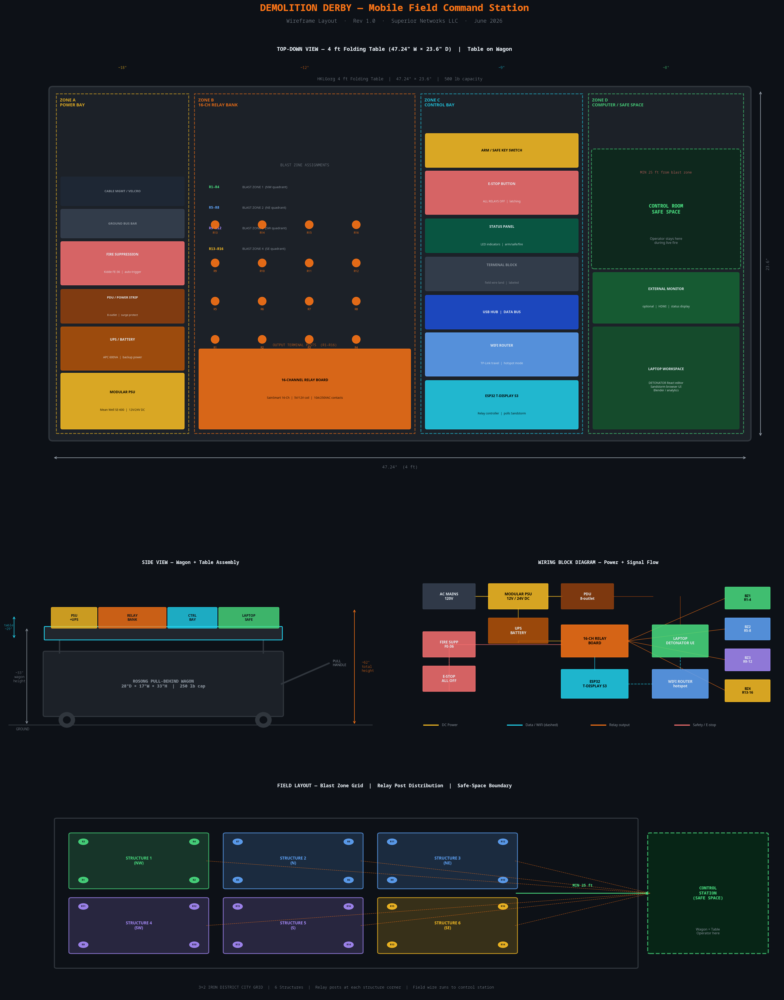

# Mobile Field Command Station — Design Specification

**Document:** MOBILE-COMMAND-STATION.md  
**Revision:** 1.0  
**Date:** June 9, 2026  
**Author:** Dwain Henderson Jr. — Research, Documentation & Safety Lead  
**Project:** [Demolition Derby](https://github.com/SuperiorNetworks/demolition-derby)

---

## Wireframe Diagram



*Top-down table layout · Side view · Wiring block diagram · Blast zone field layout*

---

## Concept

The Mobile Field Command Station is a self-contained relay control system built on a pull-behind wagon with a fold-out table. It carries all electronics, power, fire suppression, networking, and computer workspace in a single portable unit that can be wheeled to any field location and set up in under 10 minutes.

The operator stays at the station during all live events. The station defines the **safe-space boundary** — the physical location from which all relay commands are issued and monitored.

---

## Physical Platform

### Wagon (Transport + Base)

| Spec | Value | Source |
|------|-------|--------|
| Model | ROSONG Collapsible Wagon Cart (120L) | [Amazon](https://a.co/d/08xgoqiH) |
| Unfolded dimensions | 28"D × 17"W × 33"H | Product listing |
| Folded dimensions | 22" × 9.8" × 7.5" | Product listing |
| Weight capacity | 250 lbs | Product listing |
| Item weight | 12 lbs | Product listing |
| Wheels | 360° rotating front wheels, wear-resistant PU | Product listing |
| Frame | 1.2mm thick steel + 600D Oxford fabric | Product listing |
| Price (approx.) | $39.99 | Amazon |

The wagon serves as the transport chassis. All electronics ride inside the wagon during transit and are transferred to the table surface at the deployment site.

### Table (Work Surface)

| Spec | Value | Source |
|------|-------|--------|
| Model | HKLGorg 4 ft Folding Table (HDPE, Black) | [Amazon](https://a.co/d/074vXjkG) |
| Dimensions (open) | 47.24"W × 23.6"D × 29"H | Product listing |
| Weight capacity | 500 lbs | Product listing |
| Item weight | 25.5 lbs | Product listing |
| Surface material | 20% thicker HDPE plastic | Product listing |
| Frame | Powder-coated steel legs | Product listing |
| Price (approx.) | $72.99 | Amazon |

The table deploys next to the wagon at the control station. All electronics mount on the table surface. The wagon stores spare cable, tools, and transport padding.

### Combined Assembly

| Measurement | Value |
|-------------|-------|
| Table work height | 29" from ground |
| Wagon height | 33" |
| Total assembly footprint | ~6 ft × 3 ft |
| Estimated total weight (loaded) | ~80–100 lbs |
| Transport configuration | Table folds flat, wagon folds flat, both fit in truck bed or SUV |

---

## Table Zone Layout

The 47.24" × 23.6" table surface is divided into four functional zones from left to right.

```
┌──────────────────────────────────────────────────────────────────────────┐
│  ZONE A (18")  │    ZONE B (12")    │  ZONE C (9")  │   ZONE D (8")     │
│  POWER BAY     │  16-CH RELAY BANK  │  CONTROL BAY  │  COMPUTER /       │
│                │                    │               │  SAFE SPACE        │
└──────────────────────────────────────────────────────────────────────────┘
                          ← 47.24" total width →
```

---

## Zone A — Power Bay (~18" wide)

The leftmost zone houses all power infrastructure. Everything that touches AC mains or stores energy lives here, isolated from the computer workspace.

| Component | Spec / Notes |
|-----------|-------------|
| **Modular PSU** | Mean Well SE-600 or equivalent — 12V and 24V DC outputs, 600W, DIN-rail mountable |
| **UPS / Battery Backup** | APC 600VA or equivalent — keeps ESP32 and router alive during brief power interruptions |
| **PDU / Power Strip** | 8-outlet surge-protected strip — feeds laptop, monitor, router, and USB hub |
| **Fire Suppression** | Kidde FE-36 or Amerex B385T — auto-trigger capable, mounted above relay bank |
| **Ground Bus Bar** | Single-point ground for all DC equipment |
| **Cable Management** | Velcro ties, labeled runs, no loose cables across zones |

**Fire suppression placement note:** The suppression unit should be positioned to cover Zone A and Zone B (power and relay bank). These are the highest thermal risk areas. Zone D (laptop) is lower risk and farther from the relay outputs.

---

## Zone B — 16-Channel Relay Bank (~12" wide)

The relay bank is the physical core of the system. All field wire runs terminate here.

| Component | Spec / Notes |
|-----------|-------------|
| **Relay Board** | SainSmart 16-Channel 5V/12V Relay Module — 10A/250VAC contacts, optocoupler isolated |
| **Output Terminal Posts** | R1–R16, one screw terminal per channel, labeled with blast zone assignment |
| **Input wiring** | 5V control signal from ESP32 GPIO pins via ribbon or individual wires |
| **Power input** | 12V DC from PSU via fused line |
| **Mounting** | DIN rail or standoff-mounted to a sub-panel that lifts off the table |

### Relay-to-Blast-Zone Assignment

| Relays | Blast Zone | Field Location | Structure(s) |
|--------|-----------|----------------|-------------|
| R1–R4  | Zone 1 | NW quadrant | Structure 1 |
| R5–R8  | Zone 2 | NE quadrant | Structures 2–3 |
| R9–R12 | Zone 3 | SW quadrant | Structure 4 |
| R13–R16| Zone 4 | SE quadrant | Structures 5–6 |

*Phase 1 uses R1–R4 only. R5–R16 are wired and labeled but inactive until Phase 2.*

---

## Zone C — Control Bay (~9" wide)

The control bay houses the ESP32 board, networking gear, and all operator-facing controls.

| Component | Spec / Notes |
|-----------|-------------|
| **ESP32 T-Display S3** | LilyGO T-Display S3 — polls Sandstorm server, drives relay board, TFT status display |
| **WiFi Router** | TP-Link TL-WR902AC travel router or equivalent — creates local hotspot, bridges to cell data |
| **USB Hub / Data Bus** | 4-port powered USB hub — connects ESP32, laptop, and any serial monitors |
| **Terminal Block** | Phoenix Contact or equivalent — field wire land point, labeled per relay channel |
| **Status Panel** | 3-LED indicator strip — ARM (yellow), SAFE (green), FIRE (red) |
| **E-Stop Button** | Large red latching mushroom button — sends ALL RELAYS OFF command, cuts 12V to relay coils |
| **Arm / Safe Key Switch** | Keyed 2-position switch — must be in ARM position before any relay can fire |

**Key switch + E-stop interlock:** The key switch and E-stop form a hardware interlock. The key switch enables the 12V relay coil power rail. The E-stop cuts it. Software commands from the ESP32 cannot fire relays unless the key is in ARM position. This is a hard hardware constraint, not a software one.

---

## Zone D — Computer / Safe Space (~8" wide)

The rightmost zone is the operator's workspace. This is where the DETONATOR React editor and Sandstorm browser UI run.

| Component | Spec / Notes |
|-----------|-------------|
| **Laptop** | Any Windows/Mac/Linux laptop — runs DETONATOR React editor and Sandstorm browser UI |
| **External Monitor** | Optional — HDMI output for larger status display during live events |
| **Safe Space Boundary** | Operator must remain in Zone D or behind the table during any live relay fire |

**Safe space rule:** The operator does not cross in front of the table toward the blast field during any armed sequence. All commands are issued from the laptop keyboard. The E-stop is within arm's reach at all times.

---

## Wiring Architecture

### Power Flow

```
AC Mains (120V)
    → Modular PSU (12V DC / 24V DC)
        → UPS (battery backup for ESP32 + router)
        → PDU (AC outlets for laptop, monitor)
    → Ground bus bar (all equipment chassis ground)
```

### Signal Flow

```
Laptop (DETONATOR UI)
    → WiFi (Sandstorm server at icssolution.net)
        → ESP32 polls server every 1 second
            → ESP32 GPIO → Relay board control inputs
                → Relay output terminals R1–R16
                    → Field wire runs to blast zone posts
```

### Safety Interlock Flow

```
Key switch (ARM position)
    → enables 12V relay coil power rail
        → relay board can accept control signals

E-stop (pressed)
    → cuts 12V relay coil power rail
        → all relays de-energize immediately
        → field outputs go to safe (open) state
```

---

## Field Wire Runs

Field wires run from the relay output terminal posts (Zone B) out to relay posts at each structure. Wire runs should be:

- **18 AWG minimum** for runs under 50 ft
- **16 AWG** for runs 50–100 ft
- **Labeled at both ends** with relay number and structure name
- **Wound on a reel** for transport — one reel per blast zone
- **Color-coded by zone:** Zone 1 = green, Zone 2 = blue, Zone 3 = purple, Zone 4 = yellow

Each structure has **4 relay posts** (one per relay channel assigned to that zone), mounted at the structure corners. Posts are standard binding posts or banana jack terminals mounted on a small weatherproof enclosure at each structure.

---

## Fire Suppression

The Kidde FE-36 (or equivalent clean-agent suppressor) is mounted above the relay bank (Zone B) and power bay (Zone A). It should be:

- Positioned to cover the highest thermal risk area (relay board + PSU)
- Accessible for manual pull without reaching over live equipment
- Inspected before every field deployment
- Rated for electrical fires (Class C)

**Note:** FE-36 (3M Novec 1230 or equivalent) is preferred over CO2 because it does not damage electronics on discharge and is safe in an occupied operator space.

---

## Transport Configuration

| Item | Transport State | Fits In |
|------|----------------|---------|
| Wagon | Folded (22" × 9.8" × 7.5") | Trunk / truck bed |
| Table | Folded flat (~47" × 24" × 3") | Truck bed / van |
| Electronics | Packed inside wagon | Wagon interior |
| Field wire reels | Stacked in wagon | Wagon interior |
| Relay sub-panel | Padded case or foam-lined box | Wagon or separate bin |

Total transport weight estimate: ~80 lbs (wagon + table + electronics + cable).

---

## Setup Procedure (Field Deployment)

1. Pull wagon to control station location (minimum 25 ft from nearest blast zone)
2. Unfold and position table
3. Transfer electronics from wagon to table, zone by zone (A → B → C → D)
4. Connect power: PSU → UPS → PDU → all equipment
5. Connect ESP32 to relay board (ribbon cable or individual GPIO wires)
6. Connect router — verify WiFi hotspot is active
7. Run field wire reels to each structure — connect to relay terminal posts
8. Connect field wire far ends to relay posts at each structure
9. Power on ESP32 — verify TFT display shows SAFE / polling
10. Open DETONATOR UI on laptop — verify device `tdisplay1` appears in Live Control
11. Key switch to SAFE — do not arm until all personnel are clear
12. Safety officer (Dwain) confirms all personnel behind safe-space boundary
13. Key switch to ARM — system is live

---

## Bill of Materials (Estimated)

| Item | Est. Cost | Link / Notes |
|------|----------|-------------|
| ROSONG Collapsible Wagon | $39.99 | [Amazon](https://a.co/d/08xgoqiH) |
| HKLGorg 4 ft Folding Table | $72.99 | [Amazon](https://a.co/d/074vXjkG) |
| Mean Well SE-600 PSU | ~$45 | DIN-rail, 12V/24V |
| APC 600VA UPS | ~$60 | Battery backup |
| 8-outlet PDU / surge strip | ~$20 | Standard |
| Kidde FE-36 fire suppressor | ~$35 | Clean agent, Class C |
| SainSmart 16-ch relay board | ~$22 | 5V coil, optocoupled |
| Phoenix Contact terminal block | ~$15 | Labeled, 20-position |
| 3-LED status panel | ~$8 | 12V panel mount |
| E-stop mushroom button | ~$12 | Latching, 22mm |
| Key switch (2-position) | ~$8 | Panel mount |
| TP-Link travel router | ~$25 | TL-WR902AC |
| 4-port powered USB hub | ~$15 | |
| Ground bus bar | ~$10 | |
| 18 AWG field wire (200 ft) | ~$18 | 4 colors |
| Binding post terminals (24x) | ~$12 | 4 per structure × 6 |
| Velcro cable ties + labels | ~$8 | |
| DIN rail + standoffs | ~$12 | |
| **Subtotal** | **~$447** | *Does not include laptop or ESP32 (already owned)* |

---

## Ideas and Future Enhancements

The following ideas were raised during the initial design discussion and are captured here for future consideration:

**Modular sub-panel:** The relay bank (Zone B) could be built on a removable sub-panel — a piece of aluminum DIN rail plate that lifts off the table and can be swapped for a different configuration (e.g., a 4-channel Phase 1 panel vs. a 16-channel Phase 2 panel).

**Weatherproofing:** For outdoor use in variable conditions, a simple canopy or pop-up tent over the control station would protect the electronics. A clear acrylic cover over the relay bank would allow visual inspection while keeping debris out.

**Integrated cable reel storage:** The wagon could have a custom foam insert with slots for 4 cable reels (one per blast zone), keeping them organized and preventing tangling during transport.

**Second operator position:** A wireless tablet running the DETONATOR React editor could serve as a secondary monitoring station, allowing a second team member to observe status without being at the main table.

**Cellular backup:** If the WiFi router loses internet connectivity, the ESP32 could fall back to a direct local WiFi connection to the laptop (ad-hoc mode), eliminating the cloud dependency for local deployments.

---

*See also: [BOARD-DESIGN.md](BOARD-DESIGN.md) for the physical 4×6 structural board specification.*  
*See also: [EXPENSES.md](../EXPENSES.md) for the running project budget.*
